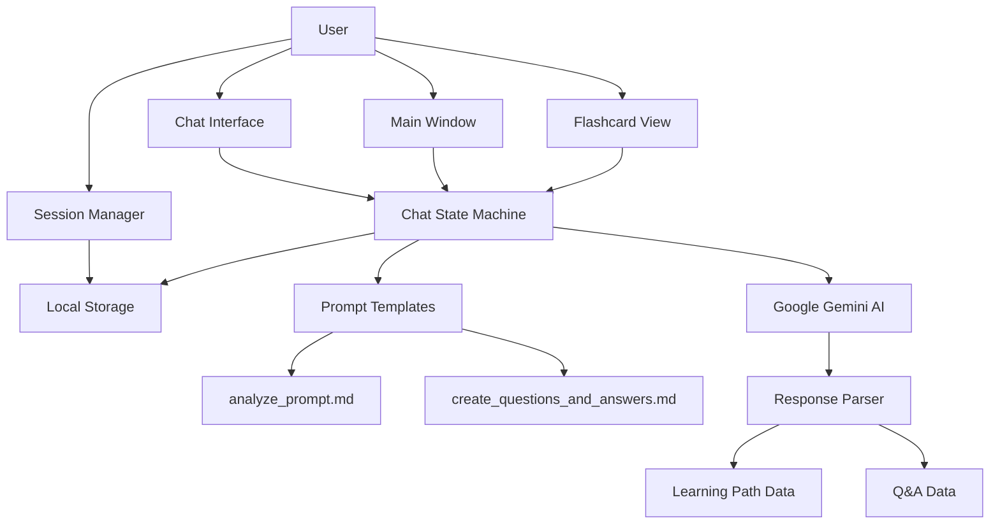
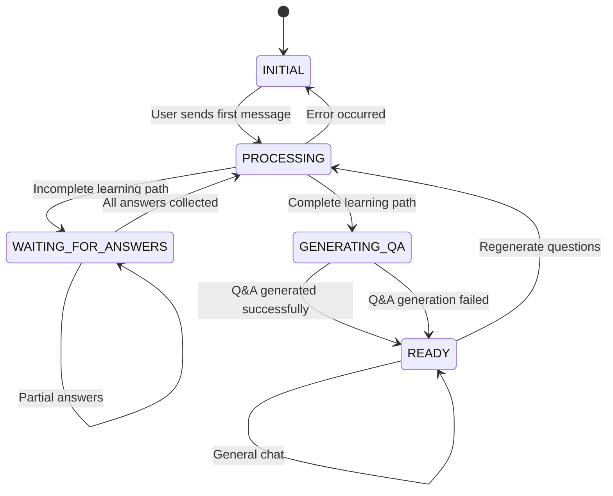
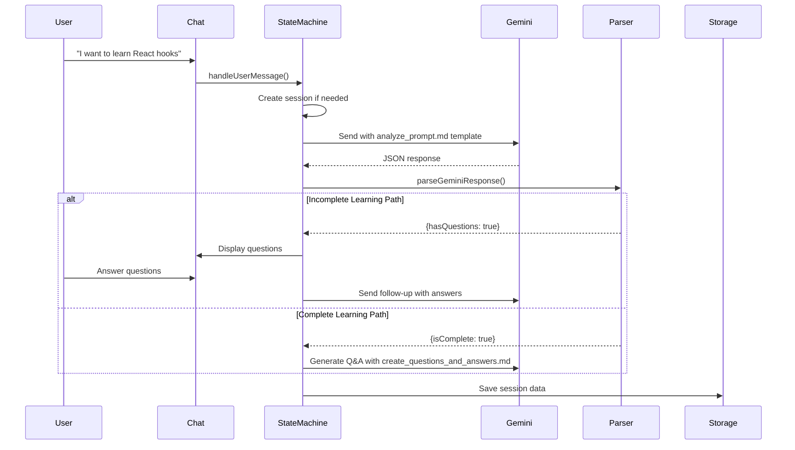
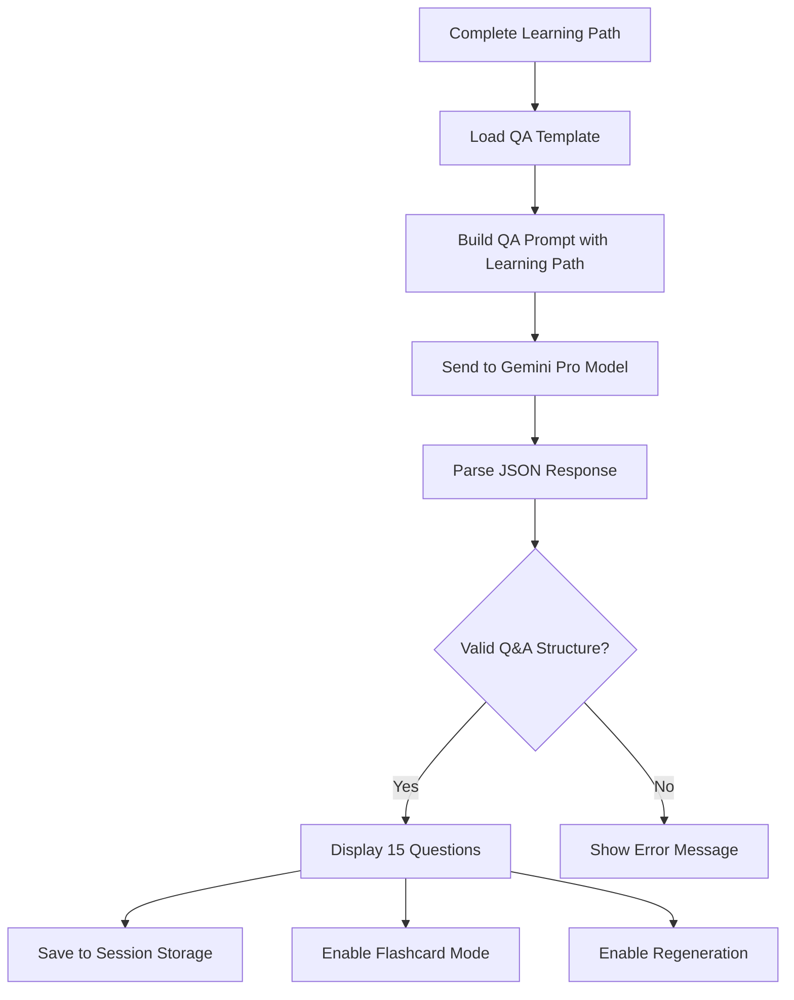
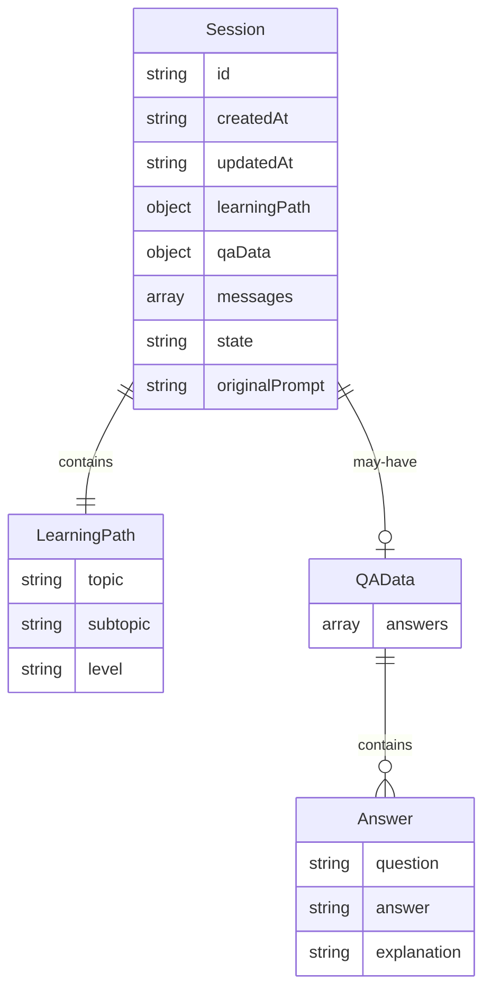
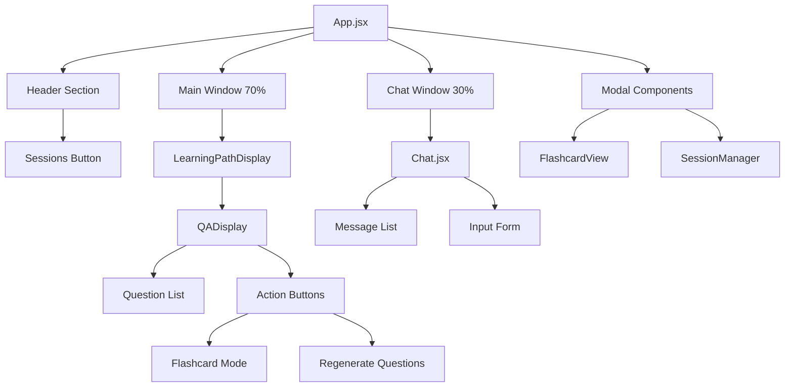
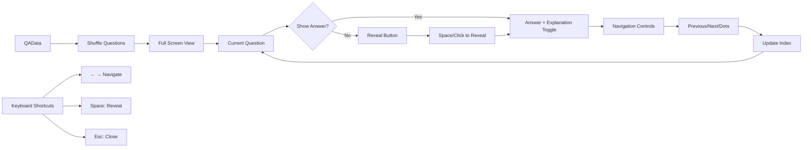
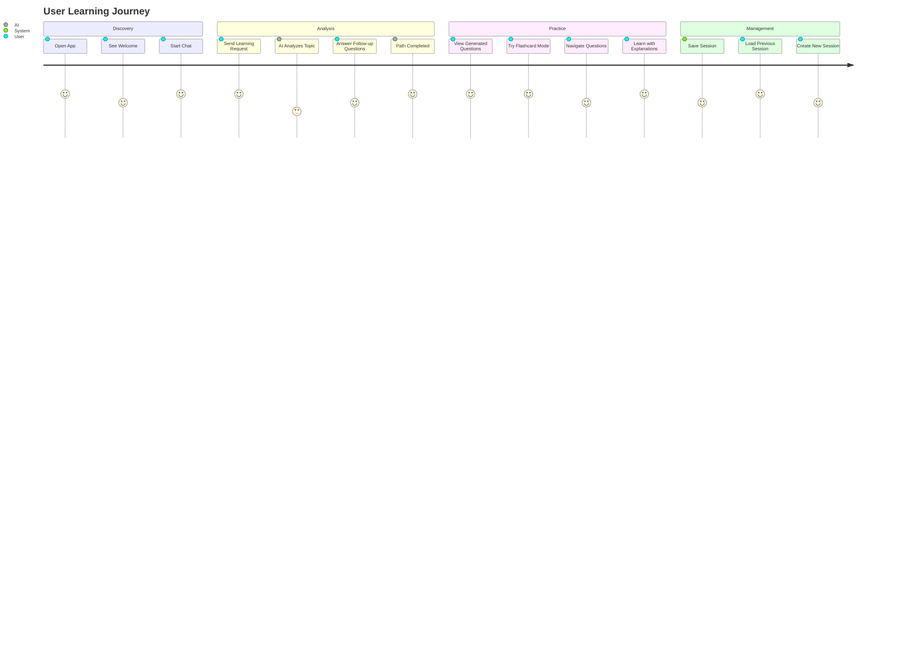
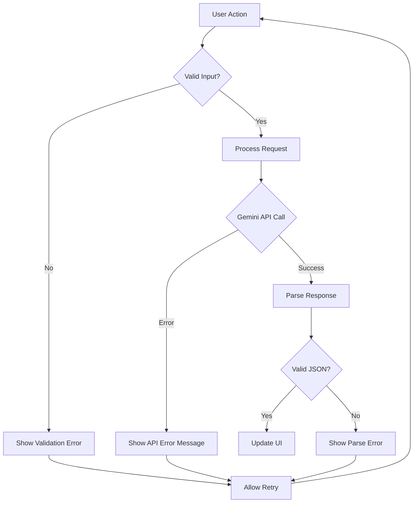
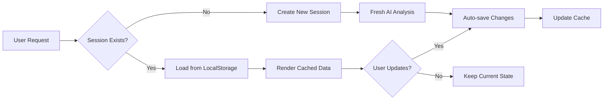

# Vibe Learning - Technical Documentation

## Overview

Vibe Learning is an AI-powered educational platform that creates personalized learning paths and practice questions using Google Gemini AI. The system analyzes user prompts to determine learning objectives and generates customized Q&A content for interactive study sessions.

## Architecture Overview



## Core Components

### 1. State Machine (`useChatStateMachine.js`)

The central orchestrator that manages the entire learning flow:



#### State Descriptions:
- **INITIAL**: Waiting for user's first learning request
- **PROCESSING**: Analyzing prompts or generating content with Gemini
- **WAITING_FOR_ANSWERS**: Collecting additional information from user
- **GENERATING_QA**: Creating practice questions and answers
- **READY**: Learning path complete, ready for interaction

### 2. Learning Path Analysis Flow



### 3. Q&A Generation Process



## Data Flow Architecture

### Session Management



### Local Storage Structure

```javascript
// Storage Keys
"vibeLearningSessions" // All sessions data
"vibeCurrentSession"   // Current active session ID

// Session Data Format
{
  "session_123": {
    "id": "session_123",
    "createdAt": "2025-01-19T...",
    "updatedAt": "2025-01-19T...",
    "learningPath": {
      "topic": "React",
      "subtopic": "Hooks",
      "level": "Intermediate"
    },
    "qaData": {
      "answers": [
        {
          "question": "What is useState?",
          "answer": "A React Hook for state management",
          "explanation": "useState allows functional components..."
        }
      ]
    },
    "messages": [...],
    "state": "ready"
  }
}
```

## Component Architecture

### Main Application Structure



### Flashcard System



## API Integration

### Gemini AI Models Used

1. **Learning Path Analysis**: `gemini-2.5-flash` (Fast, efficient)
2. **Q&A Generation**: `gemini-2.5-pro` (More accurate, detailed)

### Prompt Templates

The system uses two AI prompt templates located in the `public/` directory:

- **`public/analyze_prompt.md`**: Template for learning path analysis and follow-up question generation
- **`public/create_questions_and_answers.md`**: Template for generating 15 practice questions with answers and explanations

These templates use placeholder replacement (`[PROMPT]` and `[PLAN]`) to inject user data before sending to the Gemini AI models.

## User Experience Flow

### Complete Learning Journey



### Error Handling



## Performance Considerations

### Optimization Strategies

1. **Local Storage Persistence**
   - Automatic session saving on state changes
   - Lazy loading of session data
   - Efficient JSON serialization

2. **AI Model Selection**
   - Fast model for initial analysis
   - Accurate model for Q&A generation
   - Prompt optimization for token efficiency

3. **UI Performance**
   - React hooks for state management
   - Conditional rendering for large components
   - Event debouncing for user inputs

### Caching Strategy



## Security & Privacy

### Data Handling
- All data stored locally in browser
- No sensitive information sent to external servers
- API keys handled through environment variables
- Session data can be manually deleted

### API Security
- Gemini API key validation
- Error handling for rate limits
- Request timeout management
- Graceful degradation on API failures

## Development Guidelines

### Code Organization
```
src/
├── components/
│   ├── Chat.jsx              # Chat interface
│   ├── LearningPathDisplay.jsx # Main content area
│   ├── QADisplay.jsx         # Q&A section
│   ├── FlashcardView.jsx     # Full-screen flashcards
│   └── SessionManager.jsx    # Session management
├── hooks/
│   └── useChatStateMachine.js # Core state management
├── utils/
│   ├── sessionStorage.js     # Local storage operations
│   ├── promptTemplate.js     # AI prompt handling
│   └── responseParser.js     # AI response parsing
└── styles/
    └── *.css                 # Component-specific styles
```

### State Management Patterns
- Single source of truth in `useChatStateMachine`
- Immutable state updates
- Effect-based side effect handling
- Local storage synchronization

This documentation provides a comprehensive overview of the Vibe Learning system architecture, data flow, and implementation details.