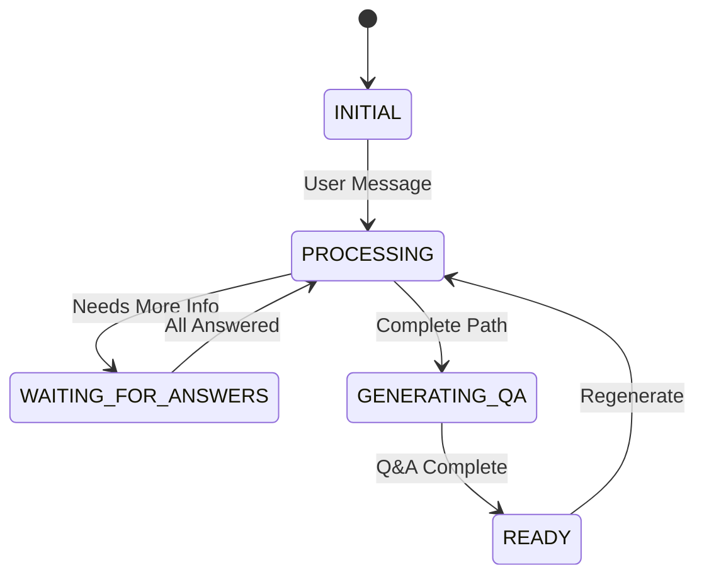

# Vibe Learning

An AI-powered educational platform that creates personalized learning paths and interactive practice questions using Google Gemini AI. Features include adaptive learning path analysis, custom Q&A generation, flashcard study mode, and persistent learning sessions.

> **Note**: This project is an experiment built using [Claude Code](https://claude.ai/code), demonstrating AI-assisted development capabilities and modern React patterns.

## 🚀 Features

### 🧠 Intelligent Learning Path Analysis
- AI-powered topic, subtopic, and difficulty level detection
- Adaptive questioning for incomplete learning objectives
- Personalized content generation based on user goals

### 💬 Interactive Chat Interface
- Real-time conversation with AI tutor (30% of screen)
- Context-aware follow-up questions
- State-driven conversation flow

### 📚 Practice Question Generation
- 15 custom questions per learning path
- Detailed answers with explanations
- AI-generated content using advanced Gemini models

### 🎴 Immersive Flashcard Mode
- Full-screen study experience with beautiful UI
- Keyboard navigation (←/→ arrows, Space, Esc)
- Question shuffling and progress tracking
- Click-to-reveal answers and explanations

### 💾 Session Management
- Automatic local storage persistence
- Load previous learning sessions
- Create new sessions with unique IDs
- Session history with metadata

### 🔄 Advanced Features
- Regenerate questions with visual loading indicators
- Compact layout optimization
- Responsive design for all screen sizes
- Export/import session capabilities

## 📋 Quick Start

### 1. Install Dependencies

```bash
npm install
```

### 2. Configure Google Gemini API Key

Create a `.env` file in the root directory:

```bash
VITE_GEMINI_API_KEY=your_api_key_here
```

Get your API key from [Google AI Studio](https://makersuite.google.com/app/apikey).

### 3. Start Development Server

```bash
npm run dev
```

### 4. Start Learning!

1. Type your learning goal (e.g., "I want to learn React hooks")
2. Answer any follow-up questions for personalization
3. Practice with generated questions
4. Use flashcard mode for intensive study
5. Sessions auto-save for later continuation

## 🏗️ Architecture

### State Machine Flow



### Component Architecture

```
┌─────────────────────────────────────────┐
│                App.jsx                  │
├─────────────────────┬───────────────────┤
│   Main Window (70%) │  Chat Window (30%)│
│                     │                   │
│ ┌─────────────────┐ │ ┌───────────────┐ │
│ │ Learning Path   │ │ │ Chat Messages │ │
│ │ Display         │ │ │ & Input       │ │
│ └─────────────────┘ │ └───────────────┘ │
│ ┌─────────────────┐ │                   │
│ │ Q&A Display     │ │                   │
│ │ + Actions       │ │                   │
│ └─────────────────┘ │                   │
└─────────────────────┴───────────────────┘

┌─────────────────────────────────────────┐
│           Modal Overlays                │
│  ┌─────────────────┐ ┌─────────────────┐│
│  │ Flashcard View  │ │ Session Manager ││
│  │ (Full Screen)   │ │                 ││
│  └─────────────────┘ └─────────────────┘│
└─────────────────────────────────────────┘
```

## 🛠️ Technology Stack

- **Frontend**: React 18 + Vite
- **AI Integration**: Google Gemini AI (2.5-flash & 2.5-pro)
- **Storage**: Browser LocalStorage
- **Styling**: CSS3 with modern animations
- **State Management**: React Hooks + Custom State Machine

## 📁 Project Structure

```
src/
├── components/
│   ├── Chat.jsx                 # Chat interface (30% width)
│   ├── LearningPathDisplay.jsx  # Main content area (70% width)
│   ├── QADisplay.jsx           # Q&A section with actions
│   ├── FlashcardView.jsx       # Full-screen flashcard mode
│   └── SessionManager.jsx      # Session management modal
├── hooks/
│   └── useChatStateMachine.js  # Core state management & AI
├── utils/
│   ├── sessionStorage.js       # Local storage operations
│   ├── promptTemplate.js       # AI prompt handling
│   └── responseParser.js       # AI response parsing
├── styles/
│   └── *.css                   # Component-specific styles
└── public/
    ├── analyze_prompt.md       # Learning path analysis template
    └── create_questions_and_answers.md # Q&A generation template
```

## 🔧 Configuration

### Environment Variables

| Variable | Description | Required |
|----------|-------------|----------|
| `VITE_GEMINI_API_KEY` | Your Google Gemini API key | Yes |

### AI Models Used

- **Learning Analysis**: `gemini-2.5-flash` (Fast response)
- **Q&A Generation**: `gemini-2.5-pro` (Higher accuracy)

## 📖 Usage Examples

### Basic Learning Session
```javascript
// User starts with a prompt
"I want to learn Python data structures"

// AI analyzes and may ask follow-ups
"What's your current programming experience level?"
"Any specific data structures you're interested in?"

// AI generates personalized learning path
{
  topic: "Python",
  subtopic: "Data Structures", 
  level: "Intermediate"
}

// 15 practice questions generated automatically
```

### Session Management
```javascript
// Sessions auto-save on changes
const session = {
  id: "session_123",
  learningPath: {...},
  qaData: {...},
  messages: [...],
  createdAt: "2025-01-19T...",
  updatedAt: "2025-01-19T..."
};

// Load previous sessions
loadSession("session_123");

// Create new session
createNewSession();
```

## 🎯 Key Features in Detail

### Intelligent Learning Path Analysis
- Analyzes user input to extract learning objectives
- Determines appropriate difficulty level
- Asks clarifying questions when needed
- Generates structured learning data

### Adaptive Q&A Generation
- Creates 15 relevant practice questions
- Provides detailed answers (<250 chars)
- Includes comprehensive explanations (<500 chars)
- Regenerates content on demand

### Immersive Flashcard Experience
- Full-screen distraction-free environment
- Keyboard shortcuts for efficient navigation
- Question shuffling for varied practice
- Progress tracking with visual indicators

### Persistent Learning Sessions
- Automatic session saving
- Resume learning across browser sessions
- Manage multiple learning topics
- Export/import capabilities

## 📚 Documentation

- **[DOCUMENTATION.md](./DOCUMENTATION.md)** - Comprehensive technical documentation with architecture diagrams and detailed implementation details
- **[PROMPTS.md](./PROMPTS.md)** - Complete chronicle of all Claude Code prompts used to build this project, demonstrating AI-assisted development process

## 🚀 Development

### Commands

```bash
npm run dev      # Start development server
npm run build    # Build for production
npm run preview  # Preview production build
```

### Development Guidelines

1. **State Management**: Use the central `useChatStateMachine` hook
2. **Styling**: Component-specific CSS files
3. **AI Integration**: Handle loading states and errors gracefully
4. **Storage**: Auto-save important state changes
5. **Performance**: Lazy load components and optimize re-renders

## 🔒 Security & Privacy

- All data stored locally in browser
- No user data sent to external servers (except AI prompts)
- API keys handled through environment variables
- Sessions can be manually deleted

## 🤝 Contributing

We welcome contributions! Please see [CONTRIBUTING.md](./CONTRIBUTING.md) for detailed guidelines on:

- Setting up the development environment
- Code style and conventions
- Testing procedures
- Pull request process
- Issue reporting guidelines

## 📄 License

This project is licensed under the MIT License.

## 🆘 Support

For issues, questions, or contributions:
- Check existing issues in the repository
- Create new issues with detailed descriptions
- Include steps to reproduce bugs
- Provide system information for technical issues